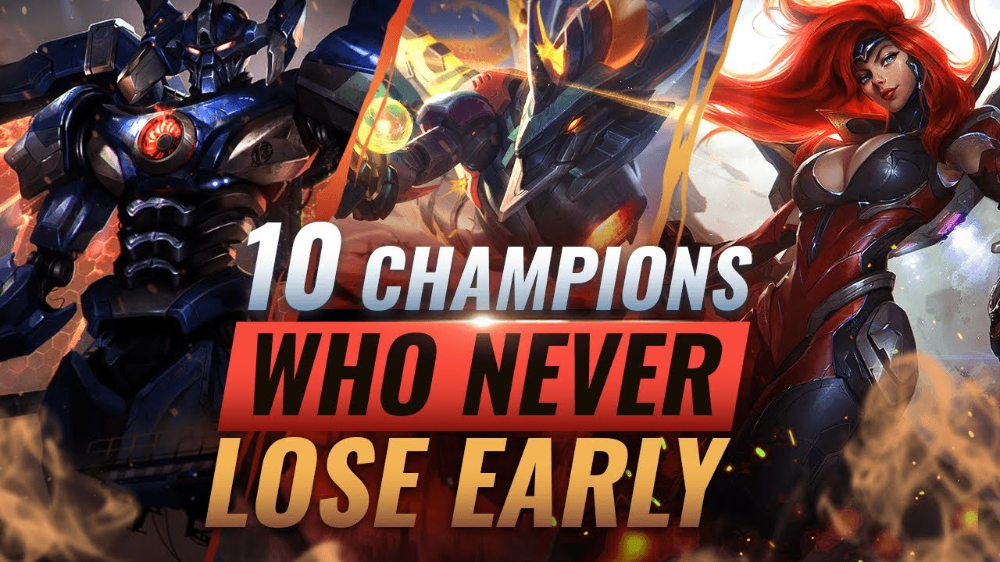
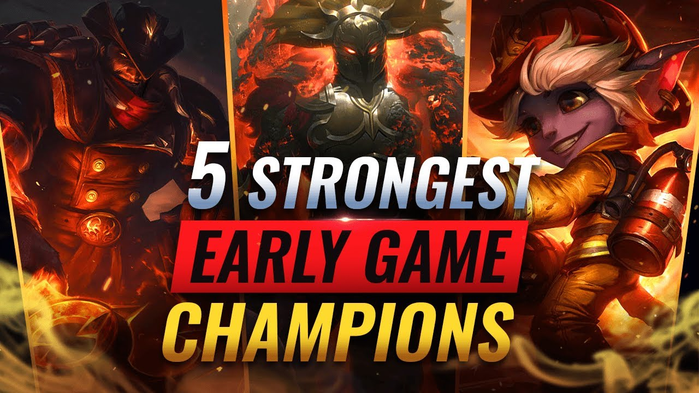

```{r setup, include=FALSE}
knitr::opts_chunk$set(echo = FALSE)
```

```{r}
library(dplyr)
library(ggplot2)
library(ggplot2)
library(ggcorrplot)
```

```{r}
data = read.csv("high_diamond_ranked_10min.csv")
```

## League of Legends


League of Legends (LoL) is a Multiplayer Online Battle Arena game where two teams (Red and Blue), each of five, face each other on the Summoners' Rift. The objective of League of Legends is to destroy the enemy team's nexus, which is located in their base. Players must work together to navigate a complex map, defeat enemy champions, and destroy defensive structures in order to gain an advantage and ultimately destroy the nexus. The team that successfully destroys the enemy nexus first wins the game.

There are several factors impacting the outcome of a LoL game. We have obtained the dataset containing statistics from games played in Diamond rank - top 1% of all players. We will attempt to understand what is the best strategy to use in order to win the game.

## Finding the most important winning factors for blue side

```{r}
keep_cols <- grep('red', names(data), invert = TRUE)
blue_data = data[, keep_cols]
keep_cols <- grep('Diff', names(blue_data), invert = TRUE)
blue_data = blue_data[, keep_cols]
```


```{r}
numeric_cols <- sapply(blue_data, is.numeric)
cor_blue = blue_data[, numeric_cols]
corr <- round(cor(cor_blue), 2)
data$redWins = ifelse(data$blueWins == 0, 1, 0)
blue_winning_factors = names(sort(corr[c("blueWins"),], decreasing=T)[1:10])
```


```{r}
corr = corr[blue_winning_factors,blue_winning_factors]
ggcorrplot(corr = corr)
```

**Conclusion:** The visualization suggests that the most important factors are Gold, Experience, and Kills

### Assumption
In League, kills are very important: They create opportunities for our team to (1) gain gold (2) denying enemy from killing minions and (3) set up for destroying turrets. As such, let us see how impactful kills are. We will specifically analyze if successfully obtaining more kills in the first 10 minutes could allow you to win the game.

Our assumption is as followed: A team should play aggressively and aim to get as much kill as possible and translate it into further advantages. We define a successful aggressive as a match where the blue team gets 1 kill per minute or more. While playing aggressively, we will undoubtedly make mistakes, so to account for that, we will let the red team to have 5 kills or more. 

```{r}
data$blueWinsCat = factor(data$blueWins)
```

```{r}
data$blueAggressiveGame = ifelse(data$blueKills>=10 & data$redKills>=5, "aggressive", "non-aggressive")
```

```{r}
ggplot(data, aes(x=blueAggressiveGame, fill=blueWinsCat)) + 
  geom_bar(position='dodge')
```
**Conclusion:** The visualization suggests that if Blue successfully play the game in an aggressive manner, there is more chance that they win than when they play passively. Next, let's check if that also allows blue to gain more gold and experiences, which creates a snowball effect on the state of the game.


#### Understanding how successfully playing aggressive affect gold gain 
```{r}
ggplot(data, aes(y=blueTotalGold, x=blueAggressiveGame, fill=blueAggressiveGame)) + 
  geom_violin(scale='width', alpha=0.5, ) +
  guides(fill='none') + 
  geom_boxplot(width=0.25)
```

**Discussion:** True to our assumptions, successfully playing aggressive allows you to lead in gold. Particularly, based on the graph, the mean gold for aggressive teams in this situation is around 18500 with an IQR of (18000, 19000). In contrast, that of non-aggressive teams is around 16500 with an IQR of (15000, 17500).
#### Understanding how successfully playing aggressive affect experience gain 

```{r}
ggplot(data, aes(y=blueTotalExperience, x=blueAggressiveGame, fill=blueAggressiveGame)) + 
  geom_violin(scale='width', alpha=0.5, ) +
  guides(fill='none') + 
  geom_boxplot(width=0.25)
```

**Discussion:** In a similar fashion, successfully playing aggressive allows you to lead in experience. From the visualization, we observe that the mean experience for aggressive teams in this situation is around 18750 with an IQR of (18000, 19000). Meanwhile, that of non-aggressive teams is around 18000 with an IQR of (17000, 18750).

#### Understanding how successfully playing aggressive affect number of turrets destroyed 

```{r}
ggplot(data, aes(x=blueTowersDestroyed)) + 
  geom_bar(aes(y = after_stat(count)/tapply(after_stat(count),after_stat(PANEL),sum)[after_stat(PANEL)])) + 
  facet_wrap(~blueAggressiveGame)
```

**Discussion:** Successfully playing aggressive also allows you to potentially get more turrets. Particularly, the probability  for aggressive teams in this situation to get a first tower in less than 10 minutes is around 10%, while that decreases to just around 3% for non-aggressive teams.

#### Understanding how successfully playing aggressive affect number of turrets destroyed

```{r}
ggplot(data, aes(x=blueEliteMonsters)) + 
  geom_bar(aes(y = after_stat(count)/tapply(after_stat(count),after_stat(PANEL),sum)[after_stat(PANEL)])) + 
  facet_wrap(~blueAggressiveGame)
```

**Discussion:** Similarly, playing aggressive allows you to potentially get more elite monsters like Dragon or Heralds, which speed up the state of the game considerably. Particularly, in less than 10 minutes, the probability  for aggressive teams in this situation to get one dragon/herald is around 45% and 10% for two, while that probability decreases to just around 40% for one and 5% for two for non-aggressive teams.

### Conclusions





#### Conclusions
League of Legends is a very interesting game: There are multiple approaches one could take in the game, and there exists no concrete formula to guarantee a win. However, in ranked games, we can capitalize on that to boost our winning chance by playing aggressive in the early game. To this end, we should pick early game champions. They could be lane bullies, assassins, gankers, or roamers. The motivation behind the increase in probability of winning when we successfully play agressive could be due to 

(1) Ranked teams do not communicate well so the game is in a more chaotic state where these champions thrive

(2) Successfully get kills opens up windows of opportunity to deal damage to turrets and take down elite monsters and 

(3) Killing champions allows you to gain gold and experience as well.

#### Recommendation

1. For toplaners, go for lane bullies like Jayce, Aatrox, or Darius.

2. For junglers, go for gankers like Lee Sin, Elise, or Jarvan IV.

3. For midlaners, go for roamers like Lissandra, Galio, or lane bullies like Tristana or Xerath.

4. For ADC, go for lane bullies like Caitlyn, Lucian, or Draven.

5. For support, go for initiators like Nautilus, Bliztcrank, or Leona.

