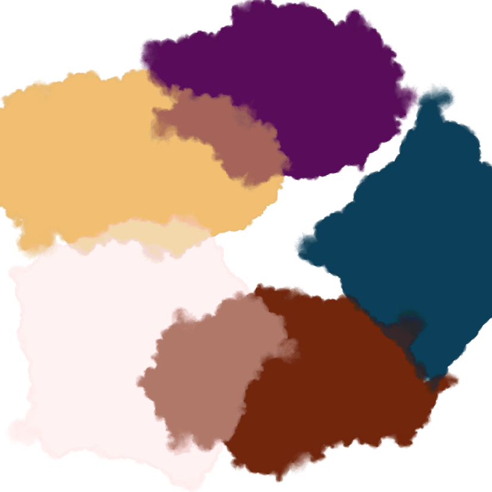
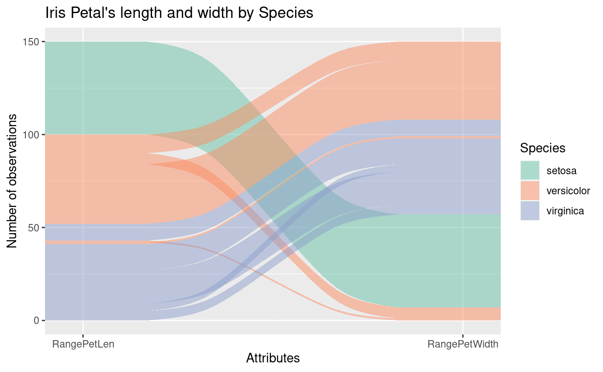
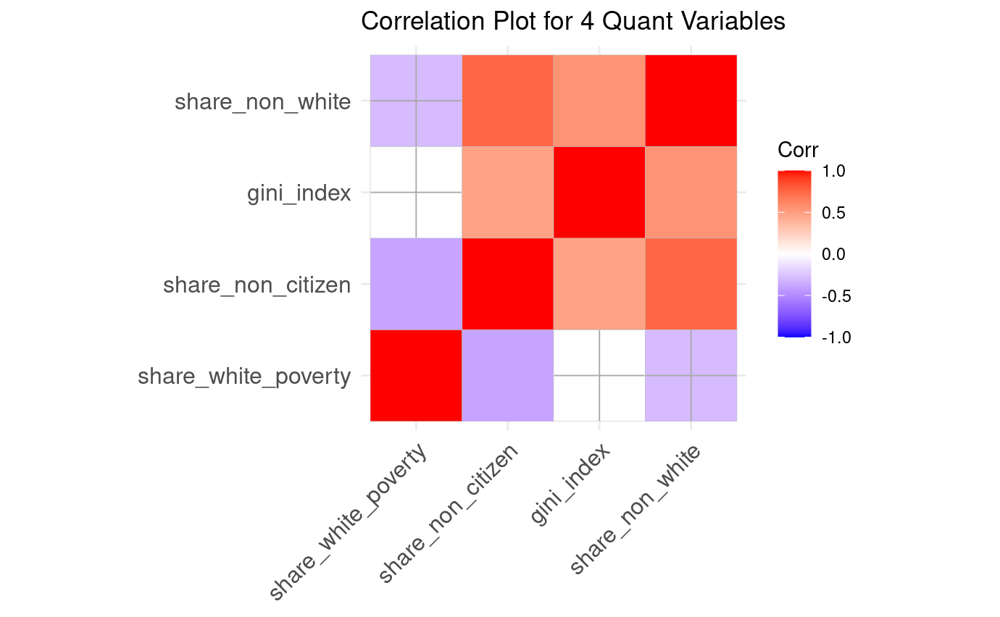
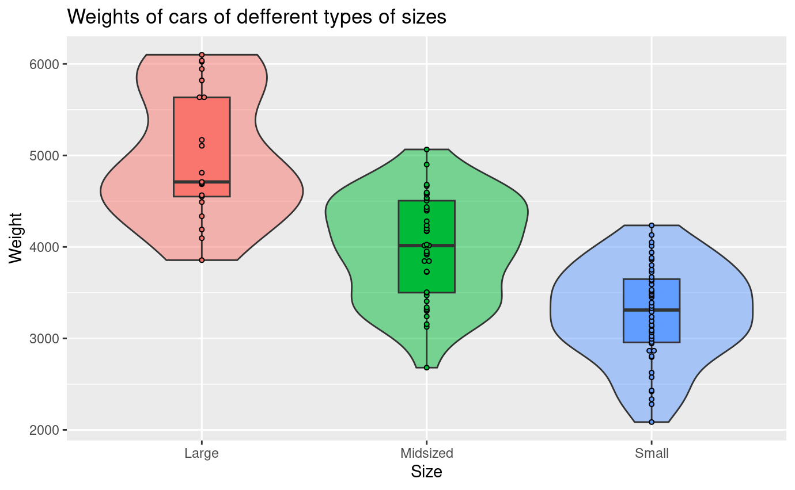
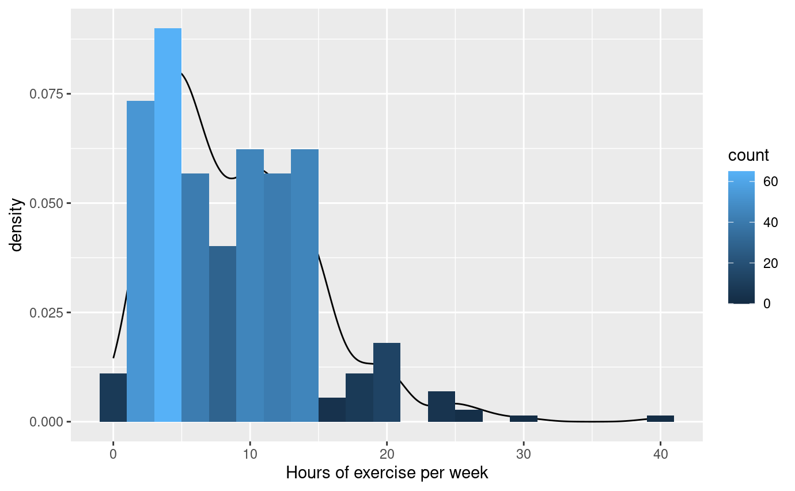

```{r setup, include=FALSE}
knitr::opts_chunk$set(echo = FALSE)
```

## Generative Arts:




## GGPlot Extensions:


**Title:** Alluvial Plot of the Length and Width of Iris Petals by Species

**The dataset:** The iris dataset gives the measurements in centimeters of the variables sepal length and width and petal length and width, respectively, for 50 flowers from each of 3 species of iris.

**Variables:** Petal Length, Petal Width, Species

**Description:** The alluvial plot illustrates the relation between the length and width of the petal of each iris species. Each species is assigned a color (setosa: green, versicolor: orange, virginica: blue). The left column shows the petal length while the right column shows the petal width. From the flows, we see that the setosa has the longest and smallest petal, the virginica has the shortest petal that is second-to-largest in width, and the versicolor has the second-to-longest petal that is the largest.


**Title:** Correlation Plot for Four Quantitative Variables of the Hate Crime Dataset

**The dataset:** The Hate Crime Dataset from the article _"Higher Rates Of Hate Crimes Are Tied To Income Inequality"_ with 51 rows representing US states and DC and 13 variables

**Variables:** Shared White Poverty, Shared Non Citizen, Gini Index, Shared Non White

**Description:** The correlation plot illustrates the correlation between each variable. Each variable is at the ith row and the (n-i)th column. The correlation is calculated for each pair of variables at every row and column. The color scale goes from red (highest correlation) to blue (lowest correlation). The significance level is set to 0.01, and in-significant correlations are marked with a cross.


## Other Visualizations:


**Title:** Plot for Weights of Cars of Different Sizes

**The dataset:** The Cars 2020 Dataset contains information about new car models in 2020 with 110 observations following 21 variables.

**Variables:** Size, Weight

**Description:** The violin plot illustrates the distribution of weights of cars wof different sizes. Every size represents a column on the x-axis. Inside the violin plots are boxplots providing additional information on the quantiles of the distribution. On the axis of each boxplot is the dot plot representing the observations.


**Title:** Plot for Students Hours of Exercise Per Week

**The dataset:** The Student Survey Dataset from a survey of students in introductory statistics courses with 362 observations following 17 variables

**Variables:** Hours of Exercise Per Week

**Description:** The bar chart illustrates the density (the y-axis) of different hours of exercise per week of students (the x-axis). The bar chart is color coded such that the lighter the blue, the higher the density. The density chart provides a smoother version of this bar chart, allowing us to better observe the distribution of this variable.

## Visualization Website

<p align="center"><iframe scrolling="no" frameborder="no" src="https://rconnect.bucknell.edu/content/369ef67a-9abf-45e0-9dc0-10745cc77a69" class="l-screen-inset shaded" style="width:1000px;height: 150vh;"></iframe></p>


